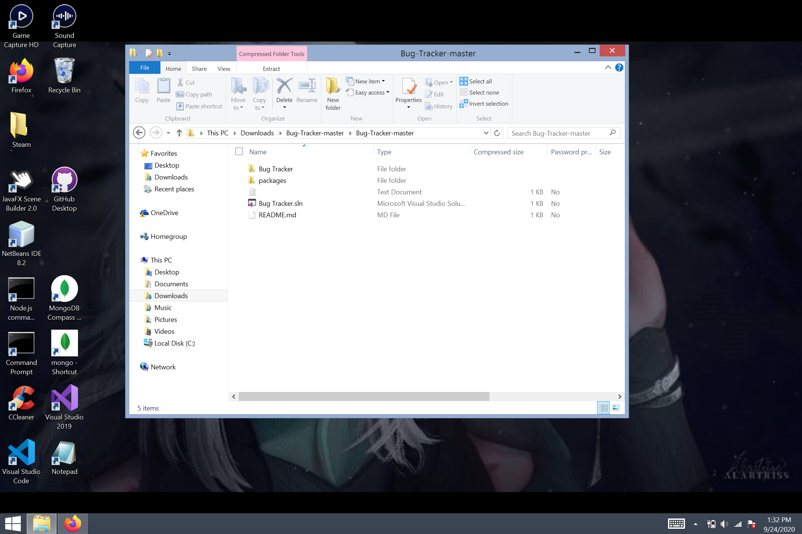

# Bug-Tracker
My Bug Tracker web app is a ASP.NET Framework 4.7 side project. It's primary function is to keep track of software bugs/issues during development. For more information, please check the wikipedia page for a bug tracker with this [link](https://en.wikipedia.org/wiki/Bug_tracking_system)

## Built With
* Bootstrap Theme -[SB Asmin 2](https://startbootstrap.com/themes/sb-admin-2/)
* MongoDB as backend - [MongoDB Atlas](https://www.mongodb.com/cloud/atlas)
* Written in HTML with [Razor Syntax](https://docs.microsoft.com/en-us/aspnet/core/mvc/views/razor?view=aspnetcore-3.1) and C#

## Installation
Download Visual Studio using this [link](https://visualstudio.microsoft.com/downloads/) to run the project. The Community is the free version.
Download Zip from this GitHub and extract it into a folder. The files you need are in the folders Bug Tracker and Packages as shown below. 

 
Install and run Visual Studio. Once that done, you should be on Get Started page. Select Open a Local Folder option to find the extracted files. 
 

 
Double click the extracted folder, which was named Bug-Tracker-Master for me.
 
 
 
Once you're on this page, with the packages. Click Select Folder at the bottom right.
 

 
Once it's all loaded. Click on View and select Solution Explorer to find all the files.
 

 
Double Click on the solution. It's named Bug Tracker.sln for me.
 

 
After this, you should be all set to run this application. To run select IIS Express to run it on your browser.
 

## Features
### Account Creation and Login

You create/register an account, and reset your password via email in case you forget

  
  

You can login with a created account or login using a Guest Account with varying privilege status

  
  

### Projects

The <b>Project</b> page displays the all the projects that the current user is involved in. This means that no matter what account privilege/status you have(Manager, Admin, Submitter, or Developer), as long as you are a part of the project currently the project will show up. Certain actions on this page are restricted based of account privilege/status like quiting and deleting the project.

  

The <b>Edit Project</b> page is only accessible to Manager and Admins. This page allows you to edit the project's information such as the details, users, and tickets.

  
  

### Tickets

The <b>Ticket</b> page has a table that contains all the tickets from your account's project(s). This means that tickets from different projects displayed here.

  

The <b>Create Ticket</b> page can be accessed from either the Project and Ticket page. This page is where any user can create a ticket/issue for a project. Only a manager or admin can assign a developer, ticket priority, and it's progress status.

  

The <b>Ticket Details</b> page displays all the ticket's information(Ticket's Detail, Ticket History, Comments on the Ticket, and Attachments). On this page, you can add a comment/note to the ticket and upload an attachment(Images).

  

The <b>Edit Ticket</b> page is where any user can access as long as the user is a part of the project. Most if not all actions are restricted or limited depending on the status. For example, updating or deleting an image can be done by the original submitter of the image, admin, and manager. This type of restriction applies to most of the Edit Ticket page.

  
  
   
  
  

### Admin Pages

The <b>Manage Project User</b> page displays all the projects where the current user is either a manager or admin. When a project is displayed, it will give the manager/admin the option to go invite or remove a user.

  

The <b>User Invite</b> page display all the users registed on the website. The datatable search on the top right of the table can be used if you know their username or email. The <b>Remove User</b> page simply allows managers/admins to remove users from project.

  
  

The <b>Manage Role Project</b> page displays all projects where the current user is a Manager, if the current user is not a Manager of any project the page will be an empty table.

  

The <b>Manage Role Assignment</b> page displays all the users within the project. This page is only accessible for managers. This page allows the manager can change the user(s) status within the project.

  

### Messages

The <b>Message</b> page displays all the user's messages and invites. This page is like an e-mail's inbox within the website.

  

The <b>Send Message</b> page allows users to send messages to other users within the website. You can mass send an email, as this page allows you to muliselect users.

  

### Profile

The <b>User Profile</b> page allows the user to change their current account information(Username, Email, and Password). To update the current information, you would need to input your current password

  

### Error Pages

The <b>Not Found</b> and <b>Unauthorized</b> pages are Error pages that are displayed when a specific error is thrown.

  

  

